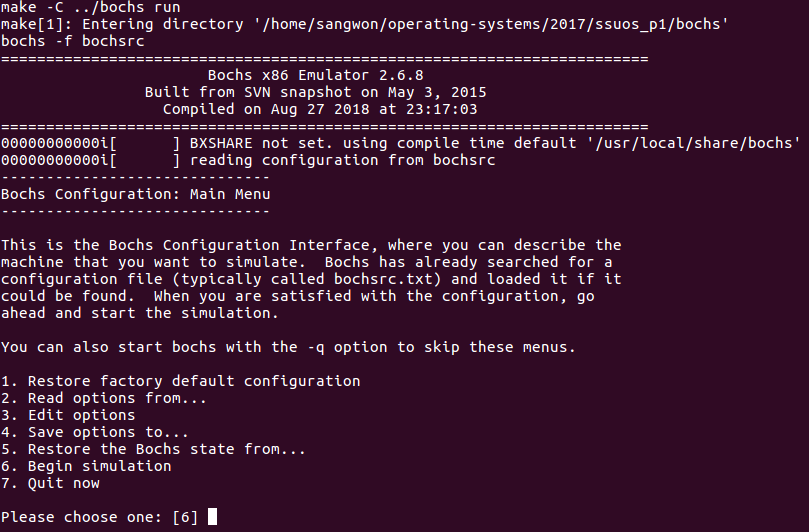
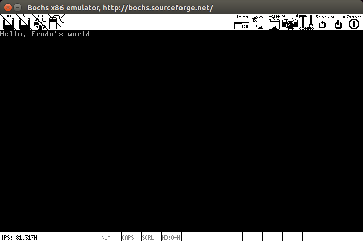

# SSU OS Tour

## Install librandr-dev and g++

```sh
$ sudo apt-get install libxrandr-dev g++
```

## Install Bochs 

* Download Bochs 2.6.8

Enter [here](https://sourceforge.net/projects/bochs/files/bochs/2.6.8/bochs-2.6.8.tar.gz/) and download bochs-2.6.8.tar.gz

* Unzip bochs-2.6.8.tar.gz and change directory to bochs-2.6.8.tar.gz

```sh
$ tar -xvf bochs-2.6.8.tar.gz
$ cd bochs-2.6.8/
```

* Execute configure

```sh
$ ./configure --with-nogui --with-x11 --enable-gdb-stub
```

* Compile

```sh
$ sudo make
$ sudo make install
```

## Install NASM

```sh
$ sudo apt-get install nasm
```

## How to execute SSU OS 

```sh
$ cd ssuos_p1/src 
$ make
$ make run
```




## Print a message on Bochs emulator

* message

```
Hello, Frodo's world
```

* result


